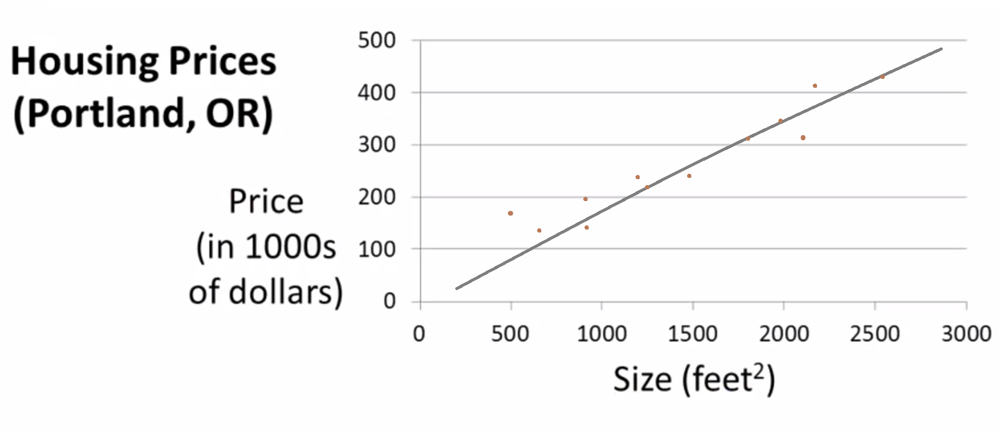

# Model Representation & Cost Function

Index

1. [Types of supervised learning](#Types-of-Supervised-Learning)
2. [Linear Regression](#Linear-Regression)
3. [ML Notations](#General-notations)

### Types of Supervised Learning

Using supervised learning we can solve two main types of problems,

  1. Classification problems

+ deals with discrete/unique categorical data.
  2. Regression problems
  + deals with continuous data or something that has a range of values.

The most commonly used types are

1. Regression

* Simple / multiple Linear Regression
  * Logistic Regression

2. Naive Bayesian model
3. Support Vector Machines
4. Random Forest
5. Neural Networks

### Linear Regression

In this section, we ll have a look at **Linear Regression** problem and the generalized **notations** used in machine learning lingua.

> Consider the housing price problem, i.e. given a set of house size (in Sq. feet) predict its prize (in $).

Here the term "price" is the actual output that is obtained after a calculation/guess whereas the term "size" is the feature that is used to make the prediction.

+ The grey line in the chart is obtained after fitting the model and is given by the equation (Equation of the straight line in maths)

  `y = mX + c`, where

  + y = is how far up in y-axis
  + x = how far along in X-axis
  + m = slope of the gradient
  + b = intercept (i.e. value of y when x is 0)
Given the feature, we can predict the future prices based on this line. This is called **Linear Regression**

#### [<< previous](./README.md)  |  [Next >>](./01_part2_model_representation.md)
