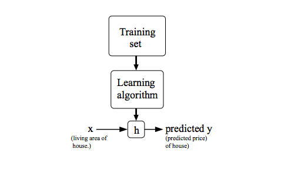

# Model Representation

1. To establish notations we will make use of  x(i) to denote the **input variable** a.k.a *input features* and *y*(i) to denote the **output** or *target variable.*
2. A pair (x(i) , y(i) ) is called a **training example**.

* where *i = 1,2, ..., m* and *m* is called as **training set**
  * Also please note that the superscript  *“(i)”* in the notation is simply an index into the training set a.k.a number of training set, and has nothing to do with exponentiation.

3. Let us consider a function *h*, such that it takes input X and returns output, Y.   i.e. *h* = X ⮕ Y
historically  this function was named as **Hypothesis**, (*h*)  for some reason.

* its given by the equation:

### *h&theta;*(x) = *&theta;*0 + *&theta;*1

  where,

* h&theta;  is called *Hypothesis function* - **Function**
  * &thetai is called *Theta* - **Parameters**
  * *i* is 1,2,3, ... ,$m$ ⭢ number of training set
  * &theta;0 is called **intercept**, i.e. the value at which the line crosses the *y* axis
* Inorder for better results we want the difference *(gap between the data points and st. line)* to be small.

#### [<< previous](./01_part1_model_representation.md)  |  [Next >>](./02_part1_cost_function.md)
