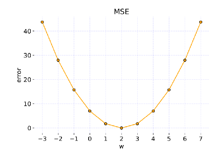
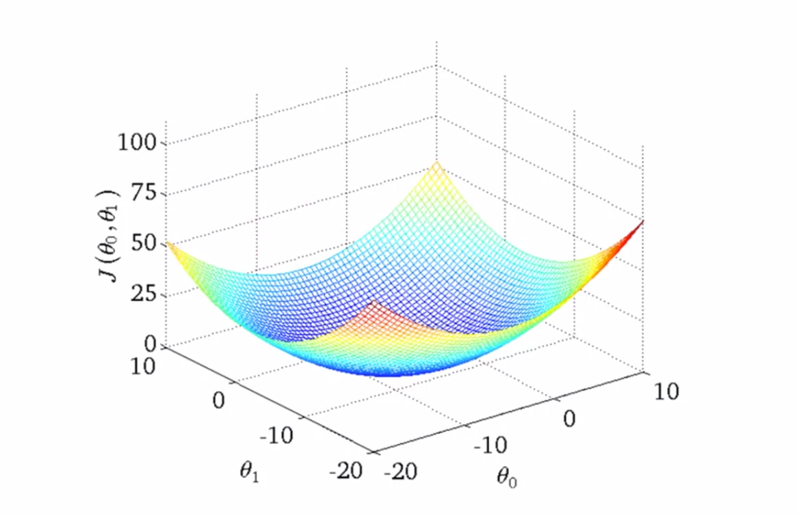
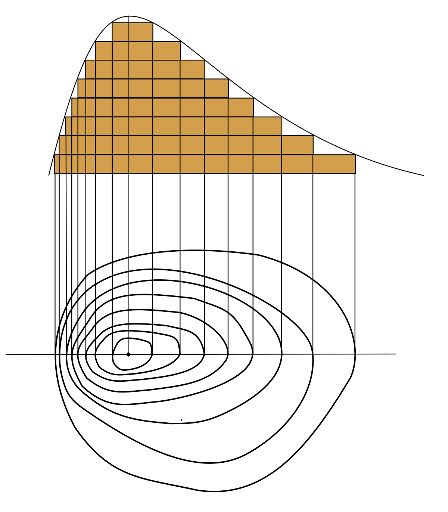

# Cost Function

## Cost Function / Squared error function / Mean Squared error

Cost functions are used **find the best possible fit of straight line to our data.** We can measure the accuracy of our hypothesis function by using a cost function.

  i.e. to minimize $\theta_{0}$ and $\theta_{1}$ such that $(h_{\theta}(x)-y)^2$ is very minimum. *Note: punishes large errors*

#### Squared error function

### $J(\theta_{0},\theta_{1})$ = $\sum_{i=1}^{m} (h_{\theta}(x^i)-y^i)^2$

* i.e. sum of (prediction - output $)^2$ should be minimum.
 $\therefore$ the cost function is given by **$J(\theta_{0},\theta_{1})$**

#### Mean Squared error

### $J(\theta_{0},\theta_{1})$ = $\frac1{2m}\sum_{i=1}^{m} (h_{\theta}(x^i)-y^i)^2$

 where

* $\frac1{2m}$ is *(half the mean)* as a convenience for the computation of the gradient descent.
* mean is $\frac {sum of all numbers}{n}$

---
### VISUALIZING COST FUNCTION

| In 2d plot with single parametric function $\theta_{1}$ | In 3d plot with two parameters $`\theta_{0}`$ and theta_{1} |
|---------------------------------------------------------|--------------------------------------------------------------|
|     |            |

* In general, we will use **contour plots** to visualize 3d plots into 2d plots.

| *(the simple working of contour plot is represented below)*        |
|--------------------------------------------------------------------|
|  |
