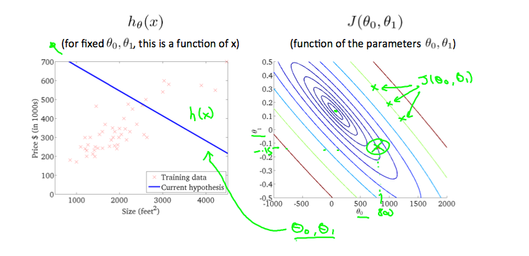

# Cost Function Intuition II

A contour plot is a graph that contains many contour lines. A contour line of a two variable function has a constant value at all points of the same line. An example of such a graph is the one to the right below.

Taking any color and going along the 'circle', one would expect to get the same value of the cost function. For example, the three green points found on the green line above have the same value for J(&theta;0,&theta;1) and as a result, they are found along the same line. The circled x displays the value of the cost function for the graph on the left when &theta;0 = 800, &theta;1 = -0.15

Taking another h(x) and plotting its contour plot, one gets the following graphs:

### Best fit

When &theta;0 = 360 and &theta;1 = 0. The value of J(&theta;0,&theta;1) in the contour plot gets closer to the center thus reducing the cost function error. Now giving our hypothesis function a slightly positive slope results in a better fit of the data.

The graph above minimizes the cost function as much as possible and consequently, the result of &theta;1 and &theta;0 tend to be around 0.12 and 250 respectively. Plotting those values on our graph to the right seems to put our point in the center of the inner most 'circle'.

---
#### [<< previous](./02_part1_cost_function.md)  |  [Next >>](./02_part1_cost_function.md)