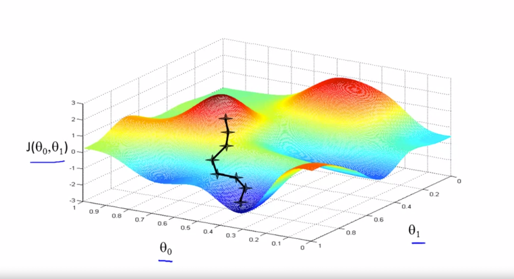
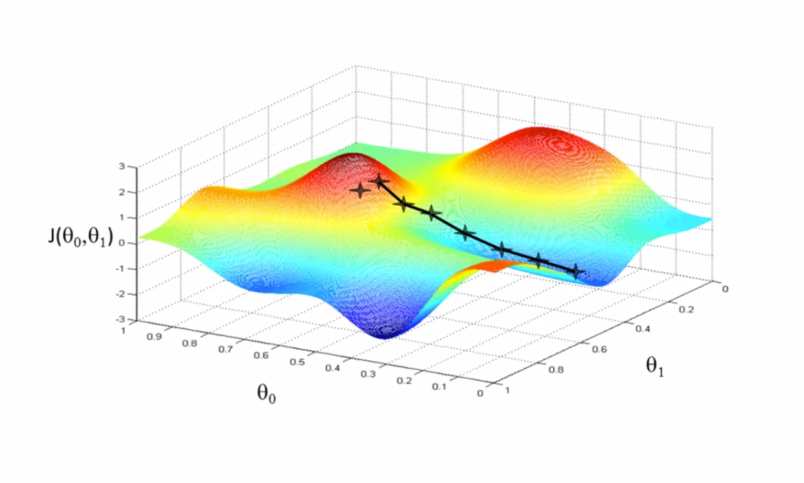
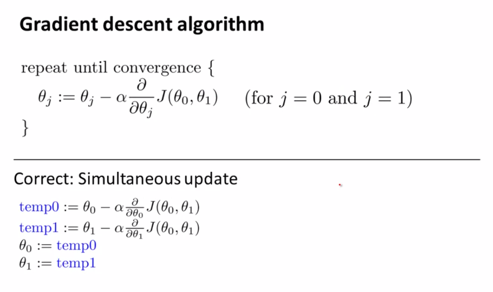

# Gradient Descent

+ It turns out to be that GD (Gradient Descent) is a generalized algorithm that is not only used for Linear Regression but for many other functions.
+ In this section, we will make use of GD to minimise the Cost Function, J.

> Given: some function J(&theta;0,&theta;1)   Want **min(*&theta;0,&theta;1*)**

**Outline**:
+ Start with some  *&theta;0* , *&theta;1*
+ Change *&theta;0* , *&theta;1* spontaneously until we end up at the minimum values.
---

To understand GD better lets assume this above graphs as an hill, You are made to stand at its peek. The only thing that you/GD can do now is rotate 360° and see where the downhill is and make baby steps/large steps go downhill asap with minimum steps.

The first time we ran Gradient Descent we were starting at point A, right?
What if we initialized the start point from another place for example, the point right to the start point of first GD. If we were to repeat GD again then it would take a look and take us to the second local optimum over on the right. Just because we started at a different position. This is a property of Gradient Descent.

---

# Mathematical way of saying Gradient Descent:

Where:
  + &alpha; is called the Learning rate, (number of steps we make)

**Note:**
 + Dont interchange updating step order
 + a = b, means a values is equal to b value. (in mathematical notations)
   + Whereas a := b, assign the value of b to a. (overriding the values)

---
#### [<< previous](./02_part2_cost_function.md)  |  [Next >>](./03_part2_gradient_descent.md)
