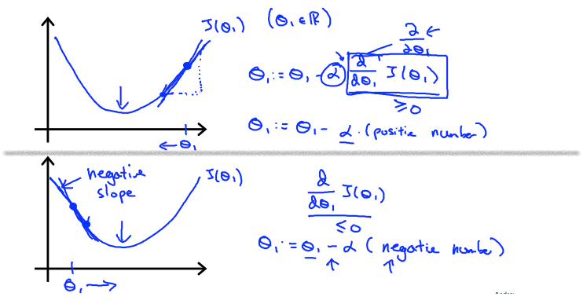
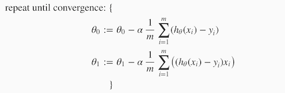

# Gradient Descent part 2

<!-- $\theta_{1} := \theta_{1} - \alpha \frac{d}{d \theta_{1}} J\theta_{1}$ --> 
We should adjust our parameter α to ensure that the gradient descent algorithm converges in a reasonable time. Failure to converge or too much time to obtain the minimum value imply that our step size is wrong.

  + If α is too small then gradient descent will become slow
  + If α is too large then GD can overshoot the minimum. And sometimes even may fail to converge, or even diverge
  + To overcome this we add d/dθ that acts as greedy algorithm using partial derivatives. i.e each time we move towards the local minima, the length of the step taken becomes small, eventhough Learning rate (&alpha;) is constant.

The following graph shows that when the slope is negative, the value of θ1 increases and when it is positive, the value of θ1 decreases.

---

## Gradient Descent For Linear Regression

When specifically applied to the case of linear regression, a new form of the gradient descent equation can
be derived. We can substitute our actual cost function and our actual hypothesis function and modify the equation to :

where m is the size of the training set, θ0 a constant that will be changing simultaneously with θ1
and xi, yi are values of the given training set (data).

Note that we have separated out the two cases for θj into separate equations for θ0 and
θ1; and that for θ1 we are multiplying xi at the end due to the derivative.
The following is a derivation of ∂&frasl;∂θ1 for a single example:

The point of all this is that if we start with a guess for our hypothesis and then repeatedly apply these gradient
descent equations, our hypothesis will become more and more accurate.

So, this is simply gradient descent on the original cost function J. This method looks at every example in the
entire training set on every step, and is called **batch gradient descent**. Note that, while gradient descent can be
susceptible to local minima in general, the optimization problem we have posed here for linear regression has only
one global, and no other local, optima; thus gradient descent always converges (assuming the learning rate α is not
too large) to the global minimum. Indeed, J is a convex quadratic function. Here is an example of gradient descent as
it is run to minimize a quadratic function.

The ellipses shown above are the contours of a quadratic function. Also shown is the trajectory taken by gradient
descent, which was initialized at (48,30). The x’s in the figure (joined by straight lines) mark the successive
values of θ that gradient descent went through as it converged to its minimum.

**Q**. Which of the following are true statements? Select all that apply.

  1. To make gradient descent converge, we must slowly decrease \alphaα over time.

  1. Gradient descent is guaranteed to find the global minimum for any function J(θ0, θ1).

  1. Gradient descent can converge even if α is kept fixed. (But α cannot be too large, or else it may fail to converge.)

  1. For the specific choice of cost function J(θ0, θ1) used in linear regression,
  there are no local optima (other than the global optimum).

**A**. 3, 4

---
#### [<< previous](./03_part1_gradient_descent.md)  |  [Next >>](./04_part1_linear_algebra.md)