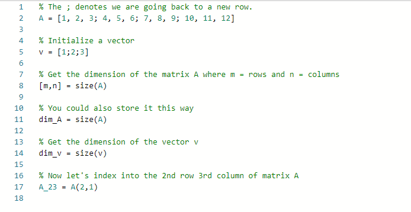
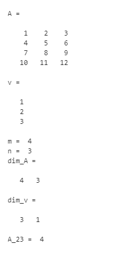

# Linear Algebra

In Linear Algebra we have two main components,

1. Matrix / Matrices
2. Vectors
3. Scalars

## Matrix

+ Matrix is a 2-Dimensional array, consisting of row (i) and columns (j).
+ Its usually represented with UpperCase letters, such as A or B ...
+ *A**ij* refers to the elements in ith row and jth column.
+ It is referred as **set of** &reals;4x2 i.e a matrix with real number having 4 rows and 2 columns

example:
<!-- $\begin{bmatrix} 1 & 2 & 1 \\ 8 & 7 & 5 \\ 3 & 9 & 5 \end{bmatrix}$ -->  or
<!-- $\begin{bmatrix} 1 & 2  \\ 3 & 4 \end{bmatrix}$ --> 

---

## Vectors

+ Vector is a 1-Dimensional array, consisting of *n* rows and 1 column.
+ aka *n-Dimensional vectors*, represented as *V*i, element in ith row.
+ In mathematical conventions all **index value starts from 1**, But in computer science aspect it will start from 0
+ denoted as &reals;*n* &rarr; n-dimensional vector of real numbers.

Example:
<!-- $\begin{bmatrix} 1 \\ 8 \\ 3 \end{bmatrix}$ -->  or <!-- $\begin{bmatrix} 19 \\ 85\\ 28 \\ 30 \end{bmatrix}$ --> 

---
## Scalar

+ "Scalar" means that an object is a single value, not a vector or matrix.

---

# Matlab/Octave program

---