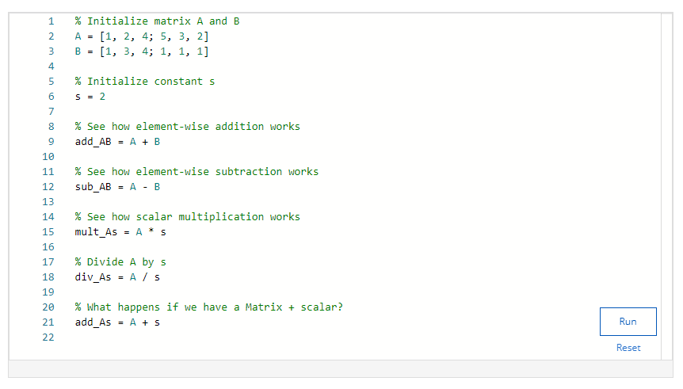
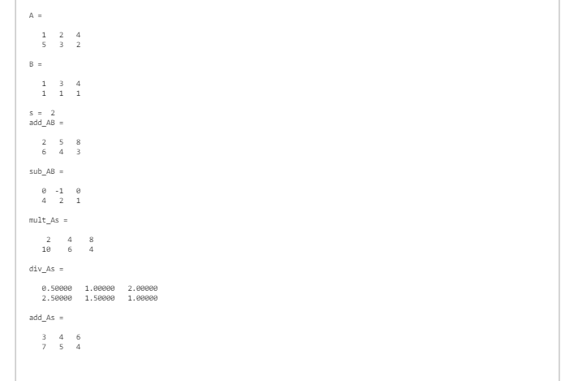
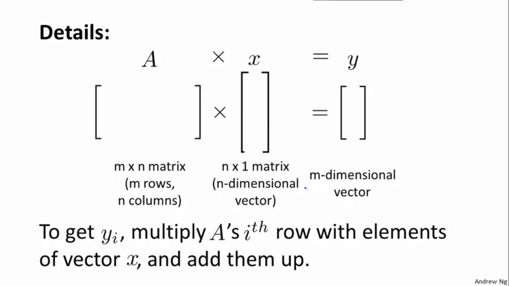
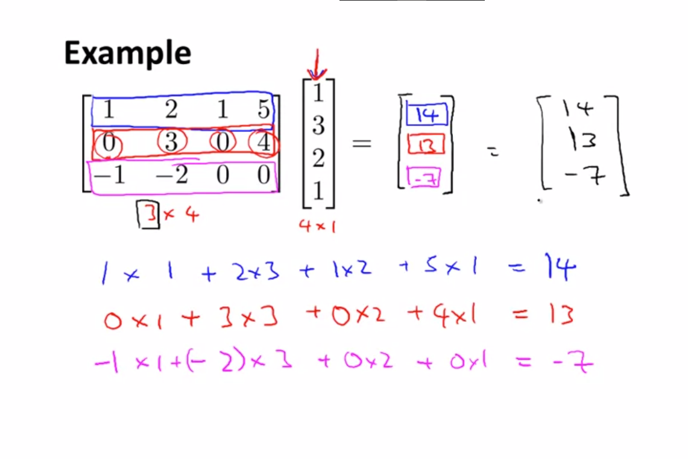
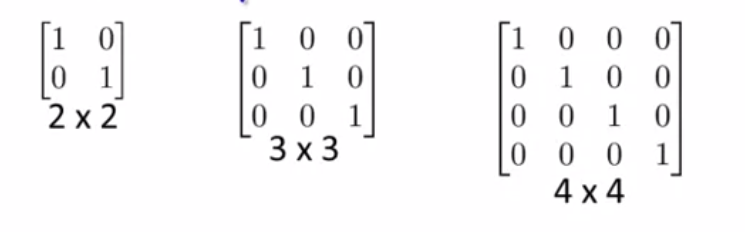

# M/V Addition and scalar multiplication

+ Addition and subtraction are element-wise, so you simply add or subtract each corresponding element

<!-- $\begin{bmatrix} a & bc & d \end{bmatrix} + \begin{bmatrix} w & xy & z \end{bmatrix} = \begin{bmatrix} a+w (b+x)(c+y) d+z\end{bmatrix}$ -->
*[a bc d] + [w xy z] = [a+w &nbsp;&nbsp; (b+x)(c+y) &nbsp;&nbsp; d+z]*

## Note:
+ To add/subtract the two matrix/vector dimensions must be the same

## Scalar Multiplication / Division
In scalar multiplication i.e when a matrix/vector is multiplied with a scalar value, we simply multiply every element with the given scalar value.

Example:
*[a bc d] \* x = [a\*x &nbsp;&nbsp; (b\*x)(c\*x) &nbsp;&nbsp; d\*x]*

---

## Matrix x Vector

### Note: *n* in the matrix must match *n* in the Vector only then matrix multiplication is possible

# Commutative property:
AxB != BxA
  + Let A be m,n dimension
  + Let B be x,y dimension
  + AxB will give m,y dimension
  + BxA will give x,n dimension
  + so clearly AxB != BxA
# Associative property:
(AxB)xC = Ax(BxC)

# Identity matrix:

+ 1 is identity, example: anything multiplied/divided by 1 will always be the same.
+ same as in matrix we have identity matrix which when multiplied with other matrix gives the same result.
+ Identity matrix is denoted by *I* or *I**n* x *n*
i.e the number of row and number of columns will be equal.

+ A * I = I * A = A

## Matrix inverse:

+ A \* A-1 = A-1 \* A = *i* , only if A is a square matrix(m,m)

+ [ 0 00 0] is called a singular or degenerated matrix which does not has an inverse.

---

## Matrix Transpose:

interchange rows as columns, cols as row
+ denoted as AT
+ if AT = B, then matrix Bji = Aij