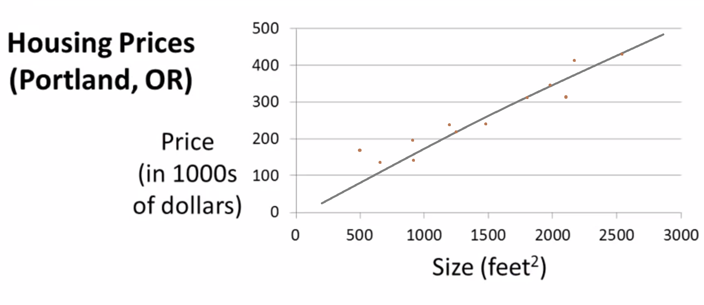

# Model Representation & Cost Function

In this section, we ll have a look at **Linear Regression** problem and the generalized **notations** used in machine learning lingua.

> Consider the housing price problem, i.e. given a set of house size (in Sq. feet) predict its prize (in $).

Here the term "price" is the actual output that is obtained after a calculation/guess whereas the term "size" is the feature that is used to make the prediction.

+ The grey line in the chart is obtained after fitting the model and is given by the equation (Equation of the straight line in maths)

  `y = mX + c`

  + where y = is how far up in y-axis
  + x = how far along in X-axis
  + m = slope of the gradient
  + b = intercept (i.e. value of y when x is 0)
Given the feature, we can predict the future prices based on this line. This is called **Linear Regression**

#### [<< previous](./README.md)  |  [Next >>](./2-parameter-learning.md)
