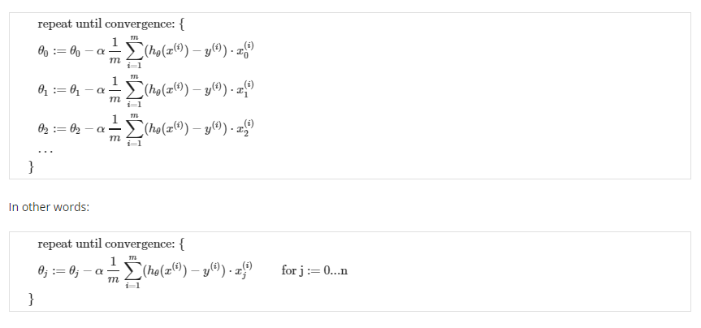
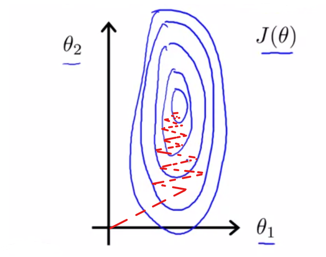
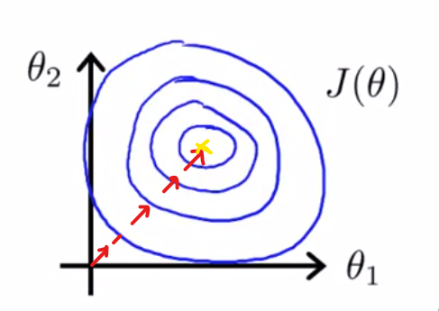

# Multiple Features

### Linear regression with multiple feature is called *Multivariate Linear Regression*.
- so the notations for multiple feature will be given by,

> x*j*(*i*)= value of the feature *j* in the ith column  
x(*i*) = the input feature of the ith training example  
*m* = number of  training examples  
*n* = number of features

- previously we know the hyperparameter, *h&theta;(x)* = &theta;0 + &theta;1*X*, where we had only a single parameter, x.

- But now the hyperparameter is given by, *h&theta;(x)* = [ &theta;0 &theta;1 . . .  &theta;*n* ] <!-- $\begin{align*}h_\theta(x) =\begin{bmatrix}\theta_0 \hspace{2em} \theta_1 \hspace{2em} ... \hspace{2em} \theta_n\end{bmatrix}\begin{bmatrix}x_0 \newline x_1 \newline \vdots \newline x_n\end{bmatrix}= \theta^T x\end{align*}$ --> 

i.e *hθ​(x)=θ0​+θ1​x1​+θ2​x2​+θ3​x3​+⋯+θn​xn​*

Remark: Note that for convenience reasons in this course we assume   <!-- $x_{0} (i)  =1 for (i∈1,…,m).$ --> 

### Gradient Descent for Multiple Variables

- the GD for multiple variable will be the same as single variable except that it will be repeated for n features.

## Parameters to fine tune gradient descent

#### 1. Feature Scaling

- If you have multiple features in Linear Regression and they are said to be in same/similar scale. Then Gradient Descent will make *J*(&theta;), Cost Function will converge quickly. Else they will take a huge time to converge because of complex trajectories.

Lets have look on contour plots with and without Feature Scaling

##### Conture plot *without* Feature Scaling

- Takes a huge time to get converge i.e. finding its way to global minimum
- plot is more skinnier/thin and tall.
- complicated trajectory.
- skew and elliptical shape

##### Conture plot *with* Feature Scaling

- with Feature scaling implemented, the plots are more round.
- takes less time to converge, i.e. to reach global minimum (yellow point).

### Feature scaling with example.
Lets consider a house price prediction where
 - **x1** = Size(0-2000 feet 2)
 - **x2** = number of bedrooms (1-5)

 the contour plot for this cost Function will look elliptical.

whereas lets implement a **simple cost Function**
where,
 - x1 = <!-- $\frac{size(feet^2)}{2000}$ --> 
 - x2 = <!-- $\frac{number of bedrooms}{5}$ --> 

the contour plot will look more circular for this, since the feature are scaled between  *0 <= x1 <= 1*, *0 <= x2 <= 1*

# Feature Scaling

- Generally in Feature Scaling we have values ranging from   -1 <= x*i* <= 1
- good ranges for Feature Scaling
  - range in 0 to 1
  - range of -1 to 1
  - range of -3 to 3
  - range of -0.01 to 0.001
  - range of -2 to 0.5
- bad ranges for Feature Scaling
  - range of -100 to 100
  - range of 0.0001 to -0.0001
  - very long range
  - very small range
- Most commonly scientists use **Mean Normalization** to scale features

### Mean Normalization
- for Mean Normalization we take a feature subtract it with the average value in the feature by the max value in the feature

SYNTAX:
  - x*i* = <!-- $\frac{Feature - Avg. value(Feature)}{Max. value - Min. value of the Feature}$ --> 
  - x1 = (x1 - &mu;1)/s

  where

  - x is Feature value
  - &mu; is Average value of feature
  - s is range of values &rarr; (max - min) / Standard Deviation

EXAMPLE:
  - x1 = <!-- $\frac{size-1000}{2000}$ --> 
  - x2 = <!-- $\frac{size-2}{5}$ --> 

---
#### [<< previous](./01_part1_matlab_setup.md)  |  [Next >>](./03_optimizing_GD.md)
