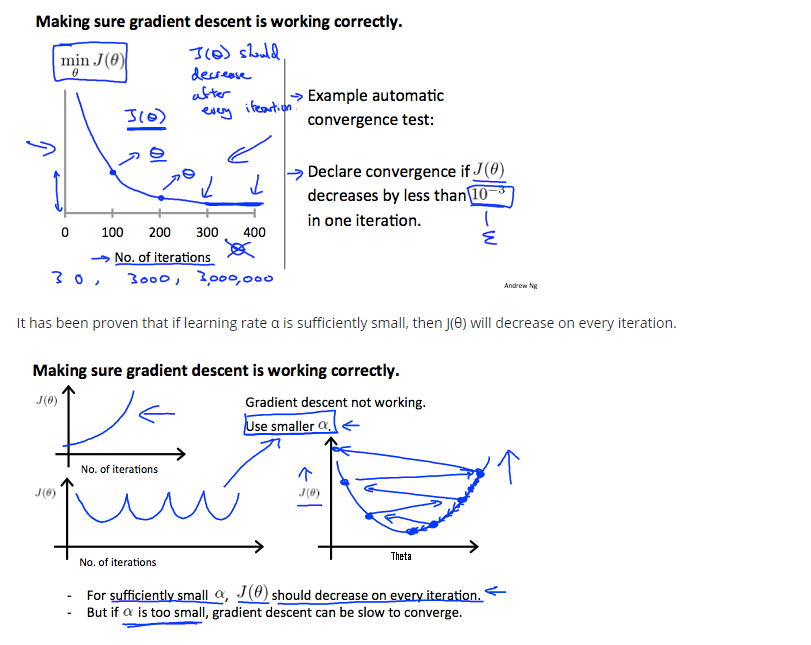

# Optimizing Gradient Descent with Learning rate

Gradient Descent, &theta;*j* := &theta;*j* - &alpha; ( ∂/∂&theta;j ) *J*(&theta;)

1. **Plot Gradient Descent** with number of iterations as x axis and cost function, J(&theta;) as y axis
2. **Automatic convergence test**, if J(&theta;) decreases with a value E, by less than 10-3 in each iteration i.e. too small values, declare convergence. However in practical it's difficult to choose this threshold value (E)

### To summarize
- if &alpha; is too small: slow convergence.
- if &alpha; is too large: J(&theta;) will not decrease in every iteration and thus may not converge

---
#### [<>]()
